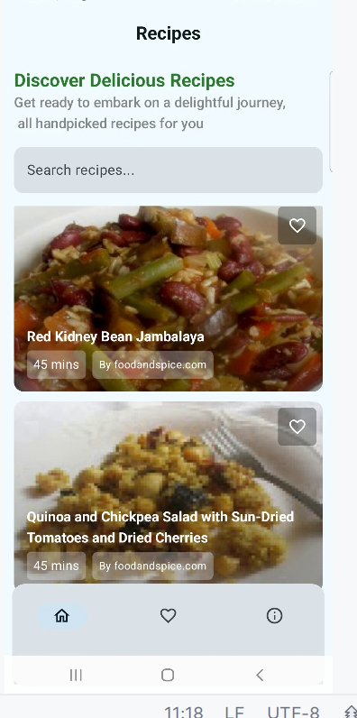
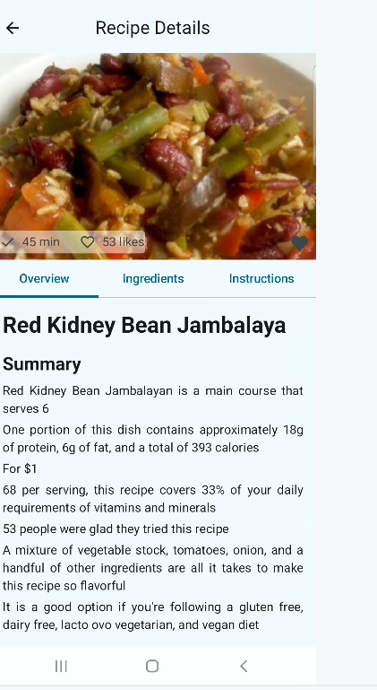
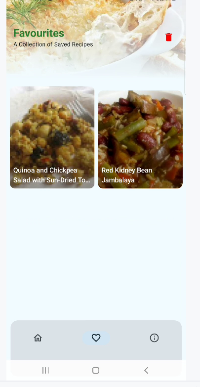
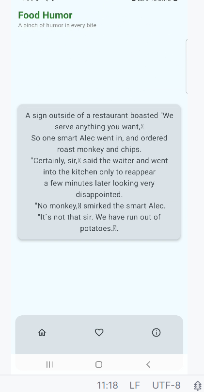

Food recipe application built with following screens
### Screen Flow
- Rceipe list screen
- Rceipe Details screen
- Favourite Receipe screen
- Receipe jokes screen

### Technologies
- Kotlin
- Jetpack Compose
- Clean Architecture
- MVVM Pattern
- Material Design 3
- Repository Pattern
- Room DB
- Hilt for DI

### Screen Shot

